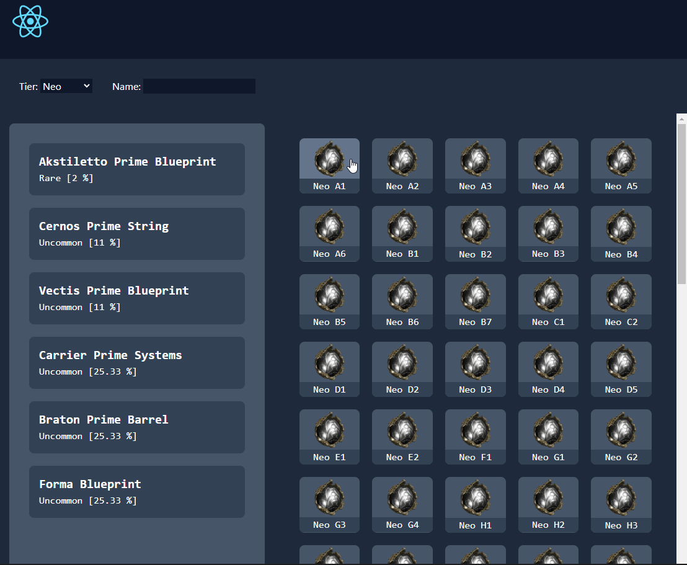

# Warframe webapp
Made with React + Typescript, this webapp lists the relics in the game Warframe and shows their content when selected.

The data is fetched from [WFCD's API](https://github.com/WFCD/warframe-drop-data).

The page is deployed using Github pages thanks to the [gh-pages](https://github.com/tschaub/gh-pages) package and can be accessed [here](https://osdanova.github.io/warframe/).

